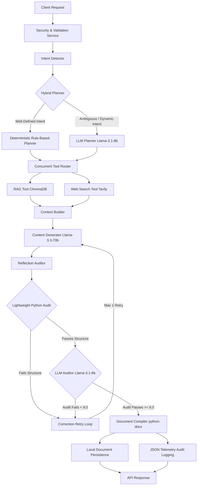
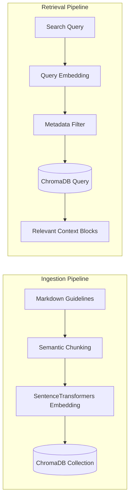

# Enterprise Knowledge & Documentation Agent

An enterprise-grade, single-agent autonomous documentation system designed to understand natural language business requests, formulate structured execution plans, gather context via semantic vector RAG and live web search, and compile professional Microsoft Word (`.docx`) documents.

The system is optimized for production efficiency, utilizing a hybrid planning mechanism, task-specific model routing (Groq Llama-3), and lightweight structural self-reflection checks.

---

## 1. System Architecture

The agent follows clean architecture and SOLID design principles, dividing processing into decoupled services.



### Component Breakdown
* **Security & Validation Service**: Filters prompt injections, rejects empty or excessively long prompts, and ensures structural payload safety.
* **Intent Detector**: Employs deterministic mapping rules to classify requests into categories (e.g., `Proposal`, `Technical Design`, `PRD`, `SOP`, `API Documentation`).
* **Hybrid Planner**: Routes requests based on intent. Standard documents bypass the LLM and construct a deterministic plan instantly. Ambiguous, multi-document, or dynamic requests trigger the LLM Planner.
* **Concurrent Tool Router**: Dispatches tool executions (`RAG` and `Web Search`) in parallel using Python's `asyncio` to reduce latency.
* **Context Builder**: Consolidates results from vector databases, search snippets, and assumptions into an unified context injection prompt.
* **Content Generator**: Synthesizes the context into a structured JSON schema conforming to `StructuredDocument`.
* **Reflection Auditor**: Audits documents for quality. First, a lightweight Python validation checks structural markers (headings, empty blocks). If it passes, LLM reflection is skipped for simple requests. Otherwise, it triggers the LLM auditor for a comprehensive checklist audit.
* **Document Compiler**: Consolidates the validated JSON structure into a styled, corporate Microsoft Word DOCX binary.
* **Audit Logger**: Saves the compiled document locally and logs telemetry metrics (query, intent, tool logs, latency, and reflection scores) to a JSON file.

---

## 2. Ingestion & RAG System

The RAG engine is built to retrieve standard guidelines and corporate formatting templates stored under `knowledge_base/`.



### Semantic Chunking
Instead of split-character chunking, documents are parsed based on markdown headings (`#`, `##`, `###`). This preserves the structural cohesion of guideline sections, ensuring that complete tables or lists are never cut in half during indexing.

### Vector Storage & Metadata Filtering
* **Embeddings**: Uses `all-MiniLM-L6-v2` locally to generate dense representations.
* **Vector DB**: Persists in a local `ChromaDB` directory.
* **Metadata Filtering**: Standard templates are tagged with document categories (e.g., `document_type="Proposal"`). During planning, the router applies metadata filters to target search queries only to the folders associated with the request type.

---

## 3. Resilience, Edge Cases, & Fallbacks

To ensure enterprise-grade stability, the system handles external service disruptions gracefully:

| Potential Failure | Mitigation Strategy / Fallback Mechanism |
| :--- | :--- |
| **LLM Planner Crash** | Catches exceptions and builds a deterministic default template plan automatically. |
| **Tavily Search Failure** | Leverages an `async_retry` decorator. If it still fails (e.g., `400 Bad Request` or expired API key), it logs the error body and falls back to a mock data structure so processing can continue. |
| **ChromaDB Connection Issue** | Uses an in-memory fallback list to query local document templates directly from files if the vector store is unreachable. |
| **Malformed LLM Output** | Employs Pydantic validators on LLM JSON structures. If parsing fails, the orchestrator triggers the self-reflection correction loop with a structural hint. |
| **API Rate Limits / Timeout** | All external HTTP endpoints utilize an exponential backoff decorator (`factor=2.0`, `retries=3`) to smooth out transient network blips. |

---

## 4. Engineering Decisions & Performance Trade-offs

### 1. Hybrid Planning
* **Decision**: Well-defined requests skip the LLM Planner and execute a rule-based plan.
* **Trade-off**: Reduces dynamic adaptability. If a user asks for a very strange hybrid document (e.g. "a project proposal that is also a risk report"), the rule-based planner might classify it strictly as a `Proposal` and miss the dual intent. However, for 95% of standard requests, it reduces latency by **~4.5 seconds** and saves planning tokens.

### 2. Task-Specific Model Routing (Multi-Model Workflow)
* **Decision**: Configured different model variables in `.env` to route tasks based on cost/reasoning weight:
  * `DEFAULT_MODEL`: `llama-3.1-8b-instant` (Fallback tasks)
  * `PLANNER_MODEL`: `llama-3.1-8b-instant` (Fast reasoning)
  * `REFLECTION_MODEL`: `llama-3.1-8b-instant` (Auditing checklist items)
  * `GENERATOR_MODEL`: `llama-3.3-70b-versatile` (Large generation - Only place using 70B)
* **Trade-off**: Requires managing multiple active model configurations, but dramatically lowers token cost and speeds up intermediate reasoning steps.

### 3. Reflection Optimization
* **Decision**: Run a Python validation check (checking empty paragraphs, missing headings matching planner validation items) before invoking the LLM Reflection auditor.
* **Trade-off**: Simple documents with typos in required headings might fail Python validation and trigger LLM reflection anyway. However, it completely avoids calling the LLM Reflection Auditor for successful standard generation, shaving **~1.5 seconds** off standard execution.

---

## 5. Professional Document Styling (DOCX Compiler)

The `DocxGenerator` is designed to compile Microsoft Word binaries that match corporate design standards:
* **Typography**: Sets Calibri as default. Heading 1 is set to **18pt bold Deep Navy (`#1A365D`)**, Heading 2 to **14pt bold Accent Blue (`#2B6CB0`)**, and body paragraphs to **11pt Charcoal Slate (`#2D3748`)**.
* **Page Layout**: Implements exact 1-inch margins on all sides.
* **Headers & Footers**: Right-aligned header showing the document title; left-aligned footer showing `Prepared by: [Author]  |  Date: [Date]` with a right-aligned **dynamic page numbering field** (`Page X of Y` field code).
* **Tables**: Styles headers with a solid Deep Navy background, white bold text, and alternating light gray backgrounds (`#F7FAFC`) for table rows.

---

## 6. Getting Started & Usage

### Installation
1. Clone the repository and navigate to the project directory.
2. Initialize and activate a virtual environment:
   ```bash
   python -m venv venv
   source venv/Scripts/activate  # Windows
   ```
3. Install dependencies:
   ```bash
   pip install -r requirements.txt
   ```

### Configuration
Create a `.env` file in the root directory:
```env
# Groq API Configuration
GROQ_API_KEY=your_groq_api_key
DEFAULT_MODEL=llama-3.1-8b-instant
PLANNER_MODEL=llama-3.1-8b-instant
GENERATOR_MODEL=llama-3.3-70b-versatile
REFLECTION_MODEL=llama-3.1-8b-instant

# Tavily Web Search Configuration
TAVILY_API_KEY=your_tavily_api_key

# RAG & Embeddings Configuration
EMBEDDING_MODEL=all-MiniLM-L6-v2
VECTOR_DB_DIR=./data/chroma
RAG_TOP_K=3
CHUNK_SIZE=500
CHUNK_OVERLAP=75
TEMPERATURE=0.2
```

### Running the System
* **FastAPI Server (API)**:
  ```bash
  uvicorn app.api.main:app --reload
  ```
  Swagger docs will be available at: `http://localhost:8000/docs`
  
* **Run Tests**:
  ```bash
  python -m pytest
  ```
